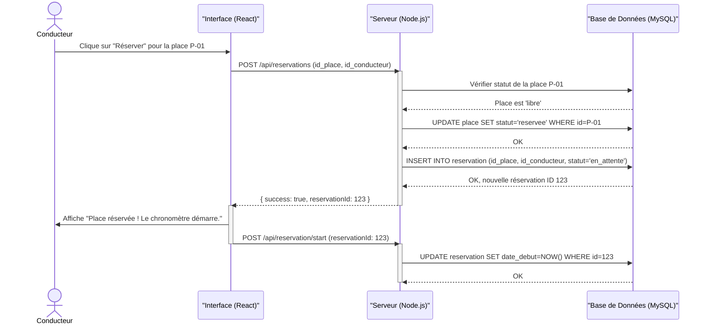
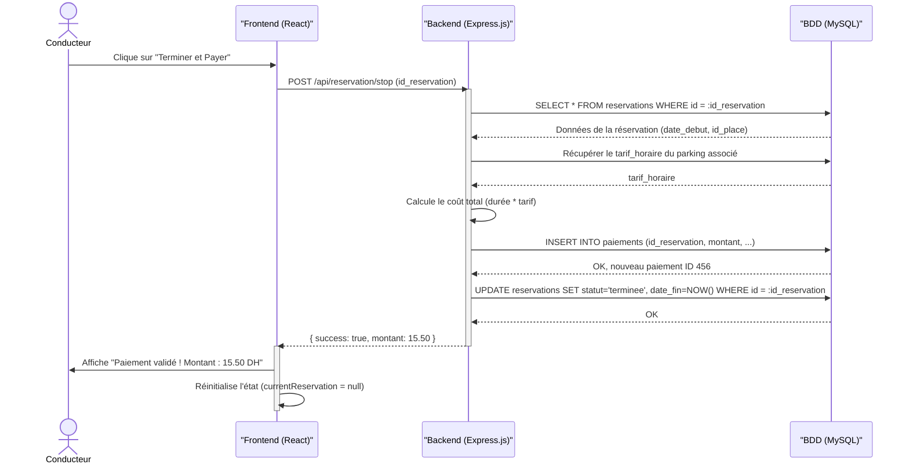
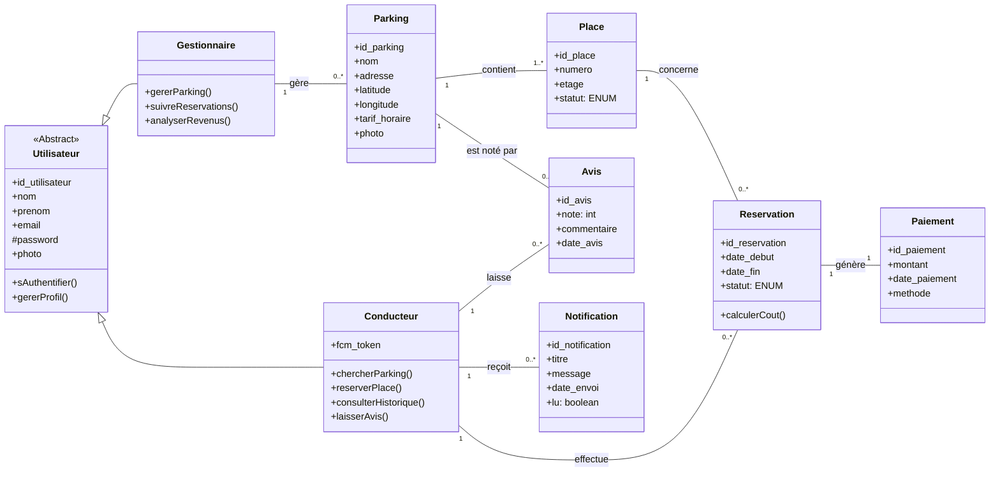

CHAPITRE 3
RÉALISATION TECHNIQUE ET PRÉSENTATION DES INTERFACES


1. Introduction

Maintenant que les plans sont prêts (Chapitre 2), il est temps de passer à la construction. Dans ce chapitre, nous allons d'abord présenter chaque technologie que nous avons utilisée et expliquer pourquoi. Ensuite, nous ferons un tour complet de l'application à travers ses interfaces, en montrant les écrans réels que voit l'utilisateur.

2. Environnement et outils de développement

Avant de coder, il a fallu mettre en place notre espace de travail. Voici les outils que nous avons utilisés au quotidien :

| Outil                | Rôle                                                        |
|----------------------|--------------------------------------------------------------|
| Visual Studio Code   | Notre éditeur de code principal, léger et très puissant     |
| Git & GitHub         | Pour sauvegarder notre code et gérer les versions            |
| Postman              | Pour tester les requêtes API avant de les connecter au site  |
| MySQL Workbench      | Pour visualiser et gérer notre base de données               |
| Navigateur Chrome    | Pour tester l'application et utiliser les outils développeur |
| Vercel               | Pour héberger et déployer le Frontend en ligne               |
| Railway              | Pour héberger le Backend (serveur Node.js + base MySQL)      |

3. Les technologies utilisées

Chaque outil a été choisi pour une raison précise. Voici un tableau récapitulatif suivi d'une explication de chacun.

| Technologie       | Côté         | Rôle dans le projet                                |
|--------------------|--------------|-----------------------------------------------------|
| React.js 19       | Frontend     | Construire l'interface utilisateur interactive       |
| Vite               | Frontend     | Outil de build ultra-rapide pour React               |
| Tailwind CSS       | Frontend     | Styliser les pages avec des classes prêtes à l'emploi|
| Leaflet            | Frontend     | Afficher la carte interactive avec les parkings      |
| Recharts           | Frontend     | Créer les graphiques du tableau de bord Manager     |
| Firebase           | Frontend     | Connexion Google + Notifications push en temps réel  |
| Axios              | Frontend     | Envoyer des requêtes HTTP vers le serveur            |
| Node.js            | Backend      | Exécuter du JavaScript côté serveur                  |
| Express.js         | Backend      | Créer les routes API (le "routeur" du serveur)       |
| MySQL              | Base de données | Stocker les utilisateurs, parkings, réservations  |
| JSON Web Token     | Sécurité     | Authentifier les utilisateurs de manière sécurisée   |
| bcrypt.js          | Sécurité     | Chiffrer les mots de passe avant stockage            |

3.1. Frontend : React.js avec Vite

React.js est une bibliothèque JavaScript créée par Facebook (Meta). Elle permet de construire des interfaces utilisateur sous forme de composants réutilisables. Elle est idéale pour créer des applications web monopages (**Single Page Application - SPA**), où le contenu est chargé dynamiquement sans avoir à recharger la page entière, offrant une expérience utilisateur fluide et rapide. Par exemple, notre barre de navigation (Navbar), notre carte interactive, et chaque page sont des composants indépendants.

Nous avons utilisé Vite comme outil de build à la place de Create React App (CRA) pour sa rapidité : le temps de démarrage en développement est quasi instantané, ce qui nous a fait gagner beaucoup de temps. Voici la configuration de Vite que nous avons utilisée :

```javascript
// vite.config.js
import { defineConfig } from 'vite'
import react from '@vitejs/plugin-react'

export default defineConfig({
  plugins: [react()],
})
```

3.2. Stylisation : Tailwind CSS + CSS personnalisé

Pour le design, nous avons combiné deux approches :
- Tailwind CSS : pour appliquer rapidement des styles (marges, couleurs, responsive) directement dans le code HTML.
- Des fichiers CSS dédiés : pour les animations complexes et les composants qui nécessitent un style très spécifique (carte des places, grille du parking, carrousel d'images).

Cette combinaison nous a permis d'obtenir un design moderne et responsive (adapté mobile et PC) sans perdre de temps.

3.3. Carte interactive : Leaflet

Pour la fonctionnalité centrale de notre application (localiser les parkings), nous avons utilisé Leaflet, une bibliothèque JavaScript open-source pour les cartes interactives. Avec son intégration React (react-leaflet), nous affichons :
- La position GPS du conducteur en temps réel.
- Les marqueurs de chaque parking avec leur prix affiché.
- Un système de zoom et de navigation fluide.

Les tuiles de la carte proviennent d'OpenStreetMap, une alternative gratuite et libre à Google Maps.

3.4. Graphiques : Recharts

Pour le tableau de bord du gestionnaire, nous avons utilisé Recharts, une bibliothèque de graphiques construite pour React. Elle nous a permis de créer des graphiques en barres montrant le nombre de réservations par jour de la semaine, de manière claire et visuelle.

3.5. Indicateur circulaire : React Circular Progressbar

Pour le chronomètre de réservation du conducteur, nous avons utilisé React Circular Progressbar. Cette bibliothèque affiche un cercle animé qui se remplit en fonction du temps écoulé, donnant au conducteur une vision claire et immédiate de la durée de son stationnement.

3.6. Notifications en temps réel : Firebase Cloud Messaging (FCM)

Pour que les utilisateurs soient informés en temps réel (nouvelle réservation, confirmation de paiement), nous avons intégré Firebase Cloud Messaging (FCM). Le fonctionnement est simple :
1. Quand l'utilisateur se connecte, l'application demande la permission d'envoyer des notifications.
2. Firebase génère un token unique pour l'appareil de l'utilisateur.
3. Le serveur backend utilise ce token pour envoyer des notifications ciblées.
4. Même si l'application est fermée, un Service Worker en arrière-plan affiche les notifications.

3.7. Authentification : Firebase Auth + JWT

Nous avons mis en place un double système de sécurité :
- Firebase Authentication : pour la connexion via Google (popup sécurisée gérée par Google).
- JSON Web Token (JWT) : pour la connexion classique par email/mot de passe. Le serveur génère un token signé qui est envoyé à chaque requête pour prouver l'identité de l'utilisateur.

3.8. Backend : Node.js + Express.js

Le serveur est construit avec Node.js et le framework Express.js. Il joue le rôle d'intermédiaire entre le Frontend (ce que voit l'utilisateur) et la Base de données (où sont stockées les informations). 

Voici la liste complète des routes API que nous avons développées :

**Routes d'authentification :**
| Méthode | Route API                            | Description                                  |
|---------|--------------------------------------|----------------------------------------------|
| POST    | /api/auth/login                      | Connexion par email et mot de passe          |
| POST    | /api/auth/signup                     | Inscription d'un nouvel utilisateur (avec photo) |
| POST    | /api/auth/google                     | Connexion via Google OAuth                   |

**Routes de gestion des parkings :**
| Méthode | Route API                            | Description                                  |
|---------|--------------------------------------|----------------------------------------------|
| GET     | /api/parkings                        | Récupérer la liste de tous les parkings      |
| GET     | /api/my-parkings/:idGest             | Récupérer les parkings d'un gestionnaire     |
| POST    | /api/admin/parking                   | Ajouter un nouveau parking (Gestionnaire)    |
| PUT     | /api/parkings/:id                    | Modifier un parking existant                 |
| DELETE  | /api/parkings/:id                    | Supprimer un parking                         |

**Routes de gestion des places :**
| Méthode | Route API                            | Description                                  |
|---------|--------------------------------------|----------------------------------------------|
| GET     | /api/places/:id_park                 | Voir toutes les places d'un parking          |
| GET     | /api/parkings/:id/places-occupees    | Voir uniquement les places occupées          |

**Routes de réservation :**
| Méthode | Route API                            | Description                                  |
|---------|--------------------------------------|----------------------------------------------|
| POST    | /api/reservations                    | Créer une nouvelle réservation               |
| POST    | /api/reservation/start               | Démarrer le chronomètre d'une réservation    |
| POST    | /api/reservation/stop                | Arrêter une réservation et calculer le coût  |
| GET     | /api/reservation/active              | Vérifier si une réservation est en cours     |
| GET     | /api/reservations/history/:userId    | Historique des réservations d'un conducteur  |
| GET     | /api/manager/reservations/:idGest    | Réservations des parkings du gestionnaire    |

**Routes de paiement :**
| Méthode | Route API                            | Description                                  |
|---------|--------------------------------------|----------------------------------------------|
| POST    | /api/paiement/confirm                | Confirmer un paiement                        |

**Routes de notifications :**
| Méthode | Route API                            | Description                                  |
|---------|--------------------------------------|----------------------------------------------|
| GET     | /api/notifications/:userId           | Récupérer les notifications d'un utilisateur |
| PUT     | /api/notifications/marquer-lu/:id    | Marquer une notification comme lue           |

**Routes des avis :**
| Méthode | Route API                            | Description                                  |
|---------|--------------------------------------|----------------------------------------------|
| GET     | /api/parkings/:id/reviews            | Récupérer les avis d'un parking              |

**Routes utilisateur et gestionnaire :**
| Méthode | Route API                            | Description                                  |
|---------|--------------------------------------|----------------------------------------------|
| POST    | /api/user/update                     | Mettre à jour le profil (avec photo)         |
| PUT     | /api/user/password                   | Changer le mot de passe                      |
| PUT     | /api/manager/update                  | Mettre à jour le profil gestionnaire         |
| GET     | /api/manager/earnings/:idGest        | Revenus et statistiques du gestionnaire      |

Au total, notre API comprend **22 routes** réparties sur 7 domaines fonctionnels.

3.9. Base de données : MySQL

Nous avons choisi MySQL, un Système de Gestion de Base de Données (**SGBD**) relationnel, pour sa robustesse et sa gestion des relations entre les données. La base contient les tables suivantes :
- **utilisateurs** : Stocke les informations des conducteurs et gestionnaires.
- **parkings** : Contient les données de chaque parking (nom, adresse, coordonnées GPS, tarif, nombre de places).
- **places** : Détaille chaque place de stationnement (numéro, état, parking associé).
- **reservations** : Enregistre chaque réservation avec les dates, le coût et le statut.
- **paiements** : Historique des paiements avec montant et méthode.
- **notifications** : Messages envoyés aux utilisateurs.
- **avis** : Notes et commentaires laissés par les conducteurs sur les parkings.

3.10. Sécurité de l'application

La sécurité a été une priorité tout au long du développement :
- **Mots de passe chiffrés** : Avec bcrypt.js, les mots de passe ne sont jamais stockés en clair dans la base de données.
- **Authentification par token JWT** : Chaque requête sensible nécessite un token valide dans l'en-tête HTTP (Authorization: Bearer <token>).
- **Protection des routes** : Les pages privées (dashboard, espace client) sont protégées côté Frontend par des composants gardiens (RequireManager, RequireClient) qui vérifient la session avant d'afficher la page.
- **Redirection intelligente** : Le système détecte le rôle de l'utilisateur et le redirige vers l'espace correspondant. Un conducteur ne peut pas accéder au dashboard et inversement.
- **Validation côté serveur** : Toutes les données reçues sont vérifiées avant d'être traitées (Middlewares authMiddleware et roleMiddleware).
- **En-têtes de sécurité HTTP** : Configuration de X-Frame-Options (protection contre le clickjacking), X-Content-Type-Options (protection contre le sniffing MIME), Referrer-Policy et Permissions-Policy.
- **Upload sécurisé** : Les photos de profil sont envoyées via FormData (multipart/form-data) et traitées côté serveur avec Multer.

3.11. Temps réel et polling

Pour offrir une expérience en temps réel sans WebSocket, nous avons implémenté un système de polling intelligent :
- **Actualisation des places** : Toutes les 3 secondes, l'application interroge le serveur pour mettre à jour l'état des places de parking (libre/occupée).
- **Chronomètre synchronisé** : Le temps écoulé est calculé à partir du serveur (`temps_ecoule_secondes`) pour éviter les décalages entre l'horloge du client et celle du serveur.
- **Badge de notifications** : Le compteur de notifications non lues est actualisé régulièrement.

3.12. Structure du projet

Voici l'arborescence complète de notre application Frontend :

```
frontend-app/
├── public/                          # Fichiers statiques
│   ├── firebase-messaging-sw.js     # Service Worker (notifications arrière-plan)
│   ├── LOGO.png                     # Logo de l'application
│   ├── slide1.png → slide5.png      # Images du carrousel
│   ├── about-video.mp4              # Vidéo de la section "À propos"
│   ├── car.mp4                      # Vidéo de la section "Solutions"
│   ├── car.png                      # Icône de voiture (places occupées)
│   └── fond.avif, fond2.avif        # Images de fond
├── src/
│   ├── App.jsx                      # Composant principal (routage + gardes)
│   ├── main.jsx                     # Point d'entrée de l'application
│   ├── firebase.js                  # Configuration Firebase (Auth + Messaging)
│   ├── pages/                       # Pages de l'application
│   │   ├── Connexion.jsx            # Page de connexion
│   │   ├── inscription.jsx          # Page d'inscription
│   │   ├── ClientHome.jsx           # Espace conducteur (carte + réservation)
│   │   ├── AccueilCarte.jsx         # Vue carte publique
│   │   ├── ClientHistory.jsx        # Historique des réservations
│   │   ├── Notifications.jsx        # Notifications du conducteur
│   │   ├── DashboardManager.jsx     # Tableau de bord gestionnaire
│   │   └── ManagerNotifications.jsx # Notifications du gestionnaire
│   ├── components/                  # Composants réutilisables
│   │   ├── Navbar.jsx               # Barre de navigation
│   │   ├── Hero.jsx                 # Section d'accueil avec carrousel
│   │   ├── AboutUs.jsx              # Section "À propos" (avec vidéo)
│   │   ├── Testimonials.jsx         # Témoignages clients (défilement infini)
│   │   ├── Questions.jsx            # FAQ (accordéon interactif)
│   │   ├── solution.jsx             # Solutions proposées (avec vidéo)
│   │   ├── Footer.jsx               # Pied de page (liens + formulaire contact)
│   │   └── ParkingTimer.jsx         # Chronomètre + processus de paiement
│   └── styles/                      # Feuilles de style CSS
│       ├── index.css                # Styles globaux
│       ├── App.css                  # Styles de l'application
│       ├── ClientHome.css           # Styles espace conducteur
│       ├── ClientHistory.css        # Styles historique
│       ├── DashboardManager.css     # Styles tableau de bord
│       ├── Notifications.css        # Styles notifications conducteur
│       └── ManagerNotifications.css # Styles notifications gestionnaire
├── index.html                       # Page HTML principale
├── package.json                     # Dépendances npm
├── vite.config.js                   # Configuration de Vite
├── tailwind.config.js               # Configuration de Tailwind CSS
├── postcss.config.js                # Configuration de PostCSS
├── eslint.config.js                 # Règles de qualité du code
└── vercel.json                      # Configuration de déploiement Vercel
```

Au total, le projet Frontend comprend :
- **6 pages** principales + 2 sous-composants de page
- **8 composants** réutilisables
- **7 fichiers CSS** pour le style
- **5 fichiers de configuration**
- **22 routes API** consommées

3.13. Internationalisation (i18n)

L'application a été conçue pour être multilingue. Grâce à un système de traduction basé sur le Contexte de React (`i18n.jsx`), tous les textes de l'interface sont disponibles en **Français** et en **Anglais**. Un bouton dans le profil utilisateur permet de basculer instantanément d'une langue à l'autre, offrant une expérience utilisateur adaptée à un public international.

3.14. Liste complète des dépendances

Voici toutes les bibliothèques utilisées dans le projet :

**Dépendances de production :**
| Bibliothèque               | Version   | Rôle                                        |
|-----------------------------|-----------|----------------------------------------------|
| react                       | 19.2.0    | Framework d'interface utilisateur            |
| react-dom                   | 19.2.0    | Rendu React dans le navigateur               |
| react-router-dom            | 7.9.5     | Routage et navigation entre les pages        |
| axios                       | 1.13.2    | Client HTTP pour les appels API              |
| firebase                    | 12.10.0   | Authentification Google + notifications push |
| leaflet                     | 1.9.4     | Carte interactive                            |
| react-leaflet               | 5.0.0     | Intégration Leaflet avec React               |
| recharts                    | 3.7.0     | Graphiques et statistiques                   |
| react-circular-progressbar  | 2.2.0     | Indicateur circulaire du chronomètre         |
| react-icons                 | 5.5.0     | Bibliothèque d'icônes (FontAwesome, etc.)    |
| lucide-react                | 0.563.0   | Icônes supplémentaires pour le dashboard     |

**Dépendances de développement :**
| Bibliothèque               | Version   | Rôle                                        |
|-----------------------------|-----------|----------------------------------------------|
| vite                        | 7.2.2     | Outil de build rapide                        |
| @vitejs/plugin-react        | 5.1.0     | Plugin React pour Vite                       |
| tailwindcss                 | 3.4.19    | Framework CSS utilitaire                     |
| postcss                     | 8.5.8     | Traitement CSS                               |
| autoprefixer                | 10.4.27   | Préfixes CSS pour compatibilité navigateurs  |
| eslint                      | 9.39.1    | Vérification de la qualité du code           |

4. Présentation des interfaces

Dans cette section, nous allons faire une visite guidée de l'application ParkSmart à travers ses différentes interfaces.

4.1. La page d'accueil (Landing Page)

La page d'accueil est la première chose que voit un visiteur. Elle est conçue pour être claire et attrayante, avec les sections suivantes :
- **Hero (Section principale)** : Un carrousel automatique de 5 images qui défilent toutes les 2,5 secondes, accompagné du slogan "Parking Made Smart & Seamless" et de deux boutons d'action : "Start Parking Now" (redirige vers l'inscription) et "Learn More".
- **Témoignages** : Un défilé automatique en boucle infinie des avis de 4 clients satisfaits pour inspirer confiance aux nouveaux visiteurs.
- **À propos** : Une section expliquant la mission de ParkSmart, accompagnée d'une vidéo de présentation intégrée (`about-video.mp4`).
- **Questions fréquentes (FAQ)** : 5 questions-réponses présentées sous forme d'accordéon interactif. L'utilisateur clique sur une question pour voir la réponse apparaître avec une animation fluide.
- **Solutions** : Présentation des 4 fonctionnalités clés (Sélection visuelle des places, Synchronisation Cloud, Application Mobile, Tableau de bord Gestionnaire), accompagnée d'une vidéo de démonstration (`car.mp4`).
- **Pied de page (Footer)** : Contient le logo, des liens rapides vers les sections du site, les réseaux sociaux, et un formulaire de contact permettant aux visiteurs d'envoyer un message directement depuis le site.

[Insérer capture d'écran de la page d'accueil]

4.2. La page de connexion

L'écran de connexion offre deux options :
- **Connexion classique** : L'utilisateur entre son email et son mot de passe.
- **Connexion Google** : Un simple clic ouvre une popup Google sécurisée.

Le système reconnaît automatiquement le rôle de l'utilisateur (conducteur ou gestionnaire) et le redirige vers l'espace correspondant.

[Insérer capture d'écran de la page de connexion]

4.3. La page d'inscription

L'inscription est simple et rapide. L'utilisateur doit :
1. Choisir son rôle : "Conducteur" ou "Gestionnaire".
2. Renseigner son nom, prénom, email et mot de passe.
3. (Optionnel) Ajouter une photo de profil.

[Insérer capture d'écran de la page d'inscription]

4.4. L'espace Conducteur

C'est le cœur de l'application pour le conducteur. Il se compose de plusieurs onglets accessibles via une barre de navigation en bas de l'écran :

**a) Onglet Carte (Accueil)**
- Une carte interactive plein écran centrée sur la position GPS de l'utilisateur (avec une double acquisition : position rapide en cache, puis position précise en arrière-plan).
- Les parkings à proximité apparaissent sous forme de marqueurs animés (avec effet de pulsation) affichant leur prix en DH.
- La carte supporte la rotation par geste à deux doigts sur mobile, et les icônes se contre-tournent pour rester lisibles.
- En cliquant sur un parking, un panneau glissant affiche les détails (nom, adresse, prix horaire, note moyenne des avis).
- Un bouton d'itinéraire (icône de flèche) permet d'ouvrir Google Maps pour guider le conducteur directement vers le parking sélectionné.
- Un bouton "Voir les places" ouvre ensuite une grille visuelle des places du parking, organisée par rangées et colonnes :
  - Vert = Place libre (cliquer pour réserver)
  - Rouge avec icône voiture = Place occupée
  - Bleu = Place sélectionnée par vous
  - Icône spéciale "Ma voiture" = Votre réservation en cours
- Les places se mettent à jour automatiquement toutes les 3 secondes grâce au polling.
- Une barre de recherche en haut permet de filtrer les parkings par nom.

[Insérer capture d'écran de la carte avec marqueurs]
[Insérer capture d'écran de la grille des places]

**b) Onglet Réservation en cours**
- Quand une réservation est active, un chronomètre en temps réel s'affiche (HH:MM:SS) avec un indicateur circulaire animé (React Circular Progressbar).
- Le temps est synchronisé avec le serveur pour éviter les décalages.
- Le coût estimé se calcule automatiquement en temps réel (durée × tarif horaire, affiché en DH).
- Une alerte automatique est envoyée au bout de 15 minutes de stationnement.
- Un bouton "Terminer et Payer" permet d'arrêter le chrono et de lancer le processus de paiement.

[Insérer capture d'écran du chronomètre de réservation]

**c) Processus de paiement**
Le paiement se fait en trois étapes :
1. **Choix de la méthode** : Carte bancaire, Google Pay, Apple Pay ou PayPal.
2. **Saisie des informations** : Numéro de carte, date d'expiration, CVV.
3. **Confirmation** : Animation de traitement avec vérification 3D Secure, puis message de succès.

[Insérer capture d'écran du processus de paiement]

**d) Onglet Historique**
- Liste de toutes les réservations passées, regroupées par période (Aujourd'hui, Cette semaine, Ce mois).
- Chaque réservation affiche le nom du parking, la durée, et la note moyenne.
- Possibilité de cliquer pour voir les détails complets.

[Insérer capture d'écran de l'historique]

**e) Onglet Notifications**
- Liste des notifications reçues (confirmations de réservation, alertes de paiement).
- Si une réservation est en cours, une carte spéciale s'affiche en haut avec le chronomètre et le coût estimé.
- Les notifications non lues sont mises en évidence par un indicateur visuel.

[Insérer capture d'écran des notifications]

**f) Onglet Profil**
- Affichage et modification des informations personnelles (nom, email, photo).
- Changement de mot de passe.
- **Changement de langue** : Un bouton permet de basculer entre le Français et l'Anglais.
- Section des méthodes de paiement.
- Conditions d'utilisation et aide.
- Bouton de déconnexion.

[Insérer capture d'écran du profil]

4.5. L'espace Gestionnaire (Dashboard)

Le tableau de bord du gestionnaire est un espace complet de gestion. Voici ses onglets :

**a) Vue d'ensemble**
Quatre cartes de statistiques en un coup d'œil :
- Nombre total de places de parking gérées.
- Revenus totaux (en DH).
- Revenus du mois en cours.
- Nombre de parkings actifs.

En dessous, un graphique en barres montre le nombre de réservations par jour de la semaine, et un panneau affiche les trois dernières réservations.

[Insérer capture d'écran de la vue d'ensemble]

**b) Mes Parkings**
- Liste de tous les parkings du gestionnaire avec photo, nom, adresse et tarif.
- Actions disponibles pour chaque parking :
  - Modifier : Changer le nom, le prix, le nombre de places.
  - Supprimer : Avec une confirmation de sécurité.
  - Voir sur la carte : Affiche la localisation du parking.
  - Voir les avis : Affiche les commentaires et notes des conducteurs.
- Bouton "Ajouter un parking" pour créer un nouveau parking avec tous ses détails (nom, adresse, coordonnées GPS, tarif, image, nombre de rangées et de places).

[Insérer capture d'écran de la liste des parkings]

**c) Réservations**
- Tableau de toutes les réservations en cours et passées sur les parkings du gestionnaire.
- Affiche pour chaque réservation : le nom du client, l'heure, le numéro de place et le statut.

[Insérer capture d'écran des réservations du gestionnaire]

**d) Revenues (Gains)**
- Tableau détaillé des paiements reçus : nom du client, montant en DH, date et statut.
- Calcul automatique des revenus : aujourd'hui, ce mois-ci, et total cumulé.

[Insérer capture d'écran des revenus]

**e) Scanner**
- Accès à la caméra du téléphone pour scanner les entrées et sorties des véhicules.
- Interface avec flux vidéo en direct.

**f) Notifications du gestionnaire**
- Panneau latéral glissant avec toutes les alertes :
  - Nouvelles réservations avec le nom du client.
  - Paiements reçus avec le montant.
  - Alertes système.
- Badge montrant le nombre de notifications non lues.
- Bouton "Tout marquer comme lu".

[Insérer capture d'écran des notifications gestionnaire]

5. Déploiement et mise en ligne

Pour rendre l'application accessible en ligne, nous avons utilisé deux services d'hébergement gratuits :

| Service    | Ce qu'il héberge           | URL                                    |
|------------|----------------------------|----------------------------------------|
| Vercel     | Le Frontend (React)        | parksmart-khadija.vercel.app           |
| Railway    | Le Backend (Node.js + MySQL)| (URL privée de l'API)                 |

Le processus de déploiement est automatisé grâce à l'intégration continue (CI/CD) :
1. Le développeur pousse le code sur GitHub avec la commande `git push`.
2. Vercel détecte automatiquement le changement et lance un nouveau build.
3. Vite compile l'application React en fichiers statiques optimisés (HTML, CSS, JS minifiés).
4. En quelques secondes, la nouvelle version est en ligne et accessible au public.

Pour la configuration de Vercel, nous avons ajouté un fichier `vercel.json` contenant :
- Les règles de réécriture (rewrites) pour que le routage côté client (SPA) fonctionne correctement sur toutes les URL.
- Les en-têtes de sécurité HTTP (X-Frame-Options, X-Content-Type-Options, Referrer-Policy, Permissions-Policy).

5.1. Les routes de l'application

Voici le tableau complet de toutes les routes accessibles dans l'application :

**Routes publiques (accessibles sans connexion) :**
| URL              | Page affichée                    | Description                           |
|------------------|-----------------------------------|---------------------------------------|
| /                | Page d'accueil                    | Landing page avec carrousel et sections |
| /home            | Accueil intelligent               | Page publique OU espace client si connecté |
| /signin          | Page de connexion                 | Login email/mot de passe + Google     |
| /signup          | Page d'inscription                | Création de compte conducteur/gestionnaire |
| /testimonials    | Témoignages                       | Avis des clients                      |
| /about           | À propos                          | Présentation de ParkSmart             |
| /questions       | FAQ                               | Questions fréquentes                  |
| /solution        | Solutions                         | Fonctionnalités proposées             |

**Routes protégées conducteur (connexion requise, rôle client) :**
| URL              | Page affichée                    | Description                           |
|------------------|-----------------------------------|---------------------------------------|
| /client-home     | Espace conducteur                 | Carte + réservation + historique      |
| /notifications   | Notifications                     | Alertes et réservations en cours      |

**Routes protégées gestionnaire (connexion requise, rôle gestionnaire) :**
| URL              | Page affichée                    | Description                           |
|------------------|-----------------------------------|---------------------------------------|
| /admin/dashboard | Tableau de bord                   | Statistiques + gestion complète       |

6. Gestion de la session utilisateur

La session de l'utilisateur est gérée via le `sessionStorage` du navigateur. Quand un utilisateur se connecte, deux informations sont sauvegardées :

| Clé          | Contenu                             | Usage                                    |
|--------------|--------------------------------------|------------------------------------------|
| `token`      | Token JWT signé par le serveur       | Envoyé dans chaque requête API sécurisée |
| `user`       | Objet JSON (id, nom, email, rôle)    | Utilisé pour l'affichage et le routage   |

Le choix de `sessionStorage` (au lieu de `localStorage`) garantit que la session est automatiquement supprimée quand l'utilisateur ferme le navigateur, ce qui renforce la sécurité.

Les deux rôles reconnus par le système sont :
- **client** (ou conducteur) : Accès à l'espace conducteur (carte, réservation, historique).
- **gestionnaire** : Accès au tableau de bord d'administration.

7. Conclusion

Ce chapitre nous a permis de présenter concrètement le résultat de notre travail. Chaque interface a été pensée pour être intuitive et agréable, que ce soit pour le conducteur pressé qui cherche une place ou pour le gestionnaire qui veut suivre son activité.

L'utilisation de technologies modernes (React, Node.js, Firebase) nous a permis de créer une application fluide et réactive, capable de fonctionner aussi bien sur mobile que sur ordinateur.


CONCLUSION GÉNÉRALE ET PERSPECTIVES


1. Bilan du projet

Ce projet de fin d'études nous a permis de concevoir et de réaliser ParkSmart, une application web complète de gestion intelligente du stationnement. En partant d'un constat simple — la difficulté quotidienne de trouver une place de parking — nous avons développé une solution qui répond aux besoins réels de deux catégories d'utilisateurs.

Pour le conducteur, ParkSmart offre :
- La localisation des parkings sur une carte interactive en temps réel.
- La visualisation de la disponibilité des places grâce à une grille visuelle intuitive.
- Un système de réservation simple avec un chronomètre et un calcul automatique du coût.
- Un processus de paiement sécurisé avec plusieurs méthodes disponibles.
- Un guidage vers le parking sélectionné via Google Maps.
- Un historique complet des réservations et un système de notifications en temps réel.

Pour le gestionnaire, ParkSmart met à disposition :
- Un tableau de bord complet avec des statistiques claires (revenus, taux d'occupation).
- Des outils de gestion de parkings (ajout, modification, suppression).
- Un suivi en temps réel des réservations et des paiements reçus.
- Un système de notifications pour être alerté des nouvelles activités.

D'un point de vue technique, ce projet nous a permis de maîtriser l'ensemble de la chaîne de développement web :
- L'analyse des besoins et la modélisation UML.
- Le développement Frontend avec React.js et les bibliothèques modernes (Leaflet, Recharts, Firebase).
- Le développement Backend avec Node.js et Express.js.
- La conception et la gestion d'une base de données relationnelle MySQL.
- Le déploiement en production sur des plateformes cloud (Vercel, Railway).
- La sécurisation de l'application (JWT, bcrypt, HTTPS, en-têtes HTTP).

2. Difficultés rencontrées

Comme tout projet informatique, nous avons fait face à plusieurs défis :
- **La gestion du temps réel** : Synchroniser le chronomètre de réservation entre le serveur et le client a nécessité un calcul précis tenant compte des décalages de fuseau horaire.
- **La géolocalisation** : Obtenir une position GPS précise rapidement sur tous les navigateurs a demandé une approche en deux étapes (position rapide puis position précise).
- **Le déploiement** : La configuration des variables d'environnement et la gestion des différences entre le développement local et la production ont requis plusieurs ajustements.
- **La sécurité** : Mettre en place un système d'authentification robuste combinant Firebase (pour Google) et JWT (pour le classique) tout en protégeant les routes sensibles.

3. Perspectives d'amélioration

Bien que ParkSmart soit fonctionnel et prêt à l'emploi, plusieurs axes d'amélioration sont envisageables pour les versions futures :

- **Intégration de capteurs IoT** : Connecter des capteurs physiques aux places de parking pour détecter automatiquement si une place est libre ou occupée, sans intervention humaine.
- **Paiement réel** : Intégrer une passerelle de paiement réelle comme Stripe ou PayPal pour traiter de vrais paiements en ligne.
- **Application mobile native** : Développer une version native avec React Native pour offrir une meilleure expérience sur smartphone (accès hors-ligne, notifications push plus fiables).
- **Intelligence artificielle** : Utiliser le machine learning pour prédire les heures de forte affluence et suggérer les meilleurs créneaux de stationnement aux conducteurs.
- **Multi-langues** : Ajouter le support de l'arabe et de l'anglais en plus du français pour toucher un public plus large.

Ce projet a été une expérience très enrichissante qui nous a permis de mettre en pratique les connaissances acquises durant notre formation en Ingénierie Logicielle. Il nous a appris à gérer un projet de bout en bout, de l'analyse du besoin jusqu'au déploiement en production.


# ANNEXES

---

## Annexe A : Glossaire

| Terme | Définition |
|-------|------------|
| **API** | Application Programming Interface - Interface de programmation |
| **REST** | Representational State Transfer - Architecture pour les API web |
| **JWT** | JSON Web Token - Standard pour l'authentification |
| **CRUD** | Create, Read, Update, Delete - Opérations de base sur les données |
| **SPA** | Single Page Application - Application à page unique |
| **FCM** | Firebase Cloud Messaging - Service de notifications push |
| **SGBD** | Système de Gestion de Base de Données |

---

## Annexe B : Bibliographie et Webographie

### Webographie :

[1] Documentation officielle de React.js – https://react.dev/
[2] Documentation de Node.js – https://nodejs.org/docs/
[3] Documentation d'Express.js – https://expressjs.com/
[4] Documentation de MySQL – https://dev.mysql.com/doc/
[5] Documentation de Leaflet – https://leafletjs.com/reference.html
[6] Documentation de Firebase – https://firebase.google.com/docs
[7] Documentation de Recharts – https://recharts.org/
[8] Documentation de Tailwind CSS – https://tailwindcss.com/docs
[9] Documentation de Vite – https://vite.dev/
[10] Documentation de Vercel – https://vercel.com/docs
[11] Documentation de Railway – https://docs.railway.com/
[12] JWT Introduction – https://jwt.io/introduction
[13] OWASP Security Guidelines – https://owasp.org/

### Outils utilisés :

[14] Visual Studio Code – https://code.visualstudio.com/
[15] GitHub – https://github.com/
[16] Postman – https://www.postman.com/
[17] MySQL Workbench – https://www.mysql.com/products/workbench/

---

## Annexe C : Diagrammes UML

Dans cette annexe, nous présentons les diagrammes UML clés qui ont guidé la conception et le développement de ParkSmart. Ces diagrammes sont écrits en utilisant la syntaxe Mermaid, ce qui permet de les intégrer et de les versionner directement avec le code.

### 1. Diagramme de Cas d'Utilisation

Ce diagramme montre les interactions entre les acteurs (Conducteur, Gestionnaire) et les fonctionnalités principales du système.

```mermaid
graph TD
    actor Conducteur
    actor Gestionnaire
 
    subgraph "Système ParkSmart"
        UC1("S'authentifier")
        UC2("Gérer son profil")
        UC3("Consulter ses notifications")
        
        subgraph "Fonctionnalités Conducteur"
            UC4("Chercher un parking")
            UC5("Réserver une place")
            UC6("Payer la réservation")
            UC7("Consulter son historique")
            UC8("Laisser un avis")
        end
 
        subgraph "Fonctionnalités Gestionnaire"
            UC9("Gérer ses parkings (CRUD)")
            UC10("Suivre les réservations")
            UC11("Analyser les revenus")
            UC12("Scanner un ticket")
        end
    end
 
    Conducteur --> UC1
    Conducteur --> UC2
    Conducteur --> UC3
    Conducteur --> UC4
    Conducteur --> UC5
    Conducteur --> UC7
    UC5 -.->|include| UC6
    UC7 -.->|extend| UC8
 
    Gestionnaire --> UC1
    Gestionnaire --> UC2
    Gestionnaire --> UC3
    Gestionnaire --> UC9
    Gestionnaire --> UC10
    Gestionnaire --> UC11
    Gestionnaire --> UC12
```

### 2. Diagramme de Séquence : Réservation d'une place

Ce diagramme détaille le processus de réservation d'une place par un conducteur, depuis la sélection sur la carte jusqu'à la confirmation.



### 4. Diagramme de Séquence : Paiement d'une réservation

Ce diagramme illustre comment une réservation est finalisée et payée par le conducteur, ce qui met fin au chronomètre.



### 3. Diagramme de Classes (Simplifié)

Ce diagramme montre les principales entités du système et leurs relations, basé sur le schéma de la base de données.


